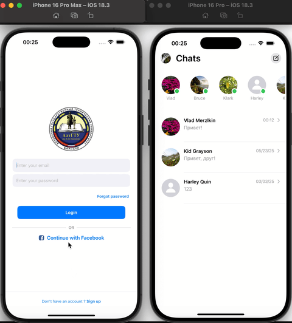
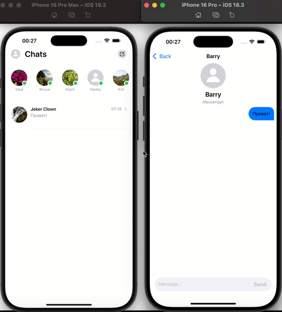

# Mobile MessengerApp

## О проекте
Данный мобильный мессенджер был разработан как петпроект для обучения. В нем я уделил внимание на взаимодействии с Firebase и использовании Combine для реактивного программирования. В коде содержится много комментариев, которые помогают понять основные идеи и внутренние механизмы приложения.

---

## Цели и задачи проекта
- Изучение и применение архитектуры MVVM для разделения логики и UI.
- Реализация регистрации и аутентификации пользователей с помощью Firebase Authentication.
- Организация обмена сообщениями в реальном времени с использованием Cloud Firestore.
- Асинхронное обновление интерфейса с помощью Combine и SwiftUI.
- Обеспечение обмена текстовыми сообщениями в реальном времени и хранение истории переписки.

---
## Примеры работы приложения

### Регистрация нового пользователя и отправка первого сообщения.

### Ответ на сообщение в режиме реального времени.

---
## Ключевые особенности реализации
- Автоматическая инициализация сессии пользователя и загрузка профиля при запуске.
- Главный экран с отображением списка чатов и последних сообщений, быстрый доступ к созданию новых диалогов.
- Возможность просмотра и редактирования профиля пользователя: имя, аватар, выход из аккаунта.
- Мгновенная отправка и получение сообщений через Firebase в чатах.
- Из-за ограничений бесплатной версии Firebase на хранение файлов в облаке, изображения (аватары и медиа) сохраняются локально на устройстве.
- Использование MVVM для структурирования кода и Combine для асинхронной работы с данными, что обеспечивает плавный и отзывчивый интерфейс.

---

## Возможные улучшения и планы на будущее
- Поддержка мультимедийных сообщений (изображения, видео, аудио).
- Реализация групповых чатов.
- Тёмная и светлая тема с возможностью переключения.
- Отображение статусов пользователей («в сети», «печатает...» и т.д.).
- Поиск по сообщениям в чатах.

---

## Используемые технологии
- **Swift** - современный язык программирования для iOS.
- **SwiftUI** - декларативный фреймворк для построения UI.
- **Firebase Authentication** - сервис для регистрации и входа пользователей.
- **Cloud Firestore** - база данных с поддержкой синхронизации в реальном времени.
- **Combine** - фреймворк для реактивного программирования и управления потоками данных.
- **Xcode** - основная среда разработки под iOS.

